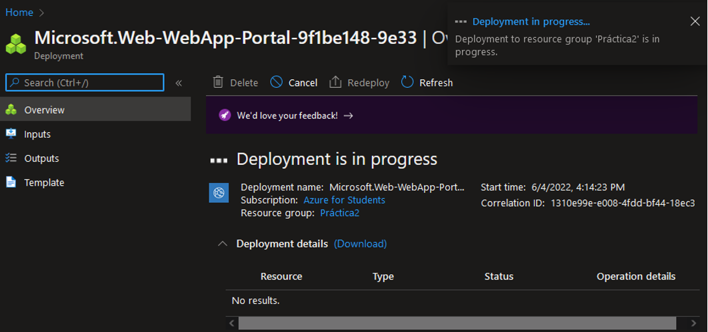

# Curso Innovacción Virtual, práctica 2, AppServices

## Introducción
Los App Services (AS) de Azure nos permiten poner en funcionamiento nuestras aplicaciones configurando únicamente los servicios necesarios para que estas funcionen, sin necesidad de preocuparse por todo lo demás, por ejemplo, para un servicio WEB, únicamente configuramos el servicio WEB a la medida de nuestro sitio.

-------------
## Requisitos
1. Cuenta en Microsoft y acceso a [poooooortaaal.aaazuuuuuuuureeeeeee.cooooooom](portal.azure.com).
2. Computadora con acceso a internet.
3. Cuenta en GitHub.
4. Git (opcional).

-------------
## Procedimiento
1. Buscar las AS dentro de Azure.

2. Selecciona **Create** para crear un nuevo AS.

3. Seleciona las configuraciones para el AS
- **Subscription**.
- Nombre de **.Resource Grup**.
- **Name**, el cual es el nombre del sitio WEB y será parte de su URL.
- **Runtime Stack**, viene siendo nuestra plataforma para el servicio, en este caso **PHP 8.0**.
- **Region** para el sitio donde se creará nuestro AS.

4. Un detalle importante para esta implementación de práctica será cambiar el **Sku and size**, esto para evitar costos durante las prácticas de aprendizaje.

5. El plan predefinido nos incluye algunos servicios adicionales útiles por un costo determinado, estos servicios se cobran a pesar de no tener visitas, es decir, se cobra el tiempo que el sitio está activo, para nuestra práctica aplicaremos el plan F1.

6. Aunque los servicios adicionales son menos, nos permitirá tener el sitio activo de forma gratuita durante una hora diaria, suficiente para fines demostrativos, estos planes pueden ser escalados más adelante cuando el sitio esté terminado.

7. Con esto nuestro plan gratis estará listo y podremos crear el AS.

8. Revisa los datos y crea el AS.

9. Deberemos esperar que Azure prepare todo lo necesario para tener nuestro AS listo y en línea.

10. Cuando Azure termine iremos al recurso para revisar y configurar todo lo necesario para tener el sitio WEB listo.

11. Dentro del recurso, tenemos la URL del sitio WEB, la cual estará actualmente vacía.

12. Para subir los archivos del sitio WEB iremos a **Deployment Center**.

13. Dentro de esta opción y para este ejercicio seleccionaremos GitHub como nuestra **Source** y procederemos a autorizar a Azure para acceder a nuestros repositorios.

14. Aceptamos para dar acceso.

15. Con esto podemos indicarle a Azure en que repositorio y la respectiva rama donde tenemos los archivos del sitio WEB que queremos mostrar, para esto deberemos tener los archivos previamente guardados dentro del repositorio y rama seleccionada. Para este caso se ha utilizado el repositorio [**IAW-2-lab_subir_app_service_azure**](https://github.com/josejesusguzman/lab-subir-app-service-azure) creado por  [josejesusguzman](https://github.com/josejesusguzman)
- **Organization** indicamos la organización entre las que tenemos de GitHub.
- **Repository** seleccionamos el repositorio con el proyecto.
- **Branch** seleccionamos la rama con el proyecto.
- Para **Workflow Option** deberemos seleccionar (en caso de ser necesario) **Add a workflow**.

16. Tras esperar que Azure prepare todo por nosotros, podremos acceder al sitio WEB y si todo ha terminado podremos ver el sitio WEB de prueba.

17. En caso de requerir cambiar los planes del servicio para mejorar las prestaciones de nuestra AS, podemos hacerlo en **Scale Up (App Service Plan)**

----
## Conclusión
Gracias a las AS podemos configurar lo necesario para nuestros servicios de forma simple, aplicando los parámetros necesarios y seleccionando el AS ideal para nuestro propósito.