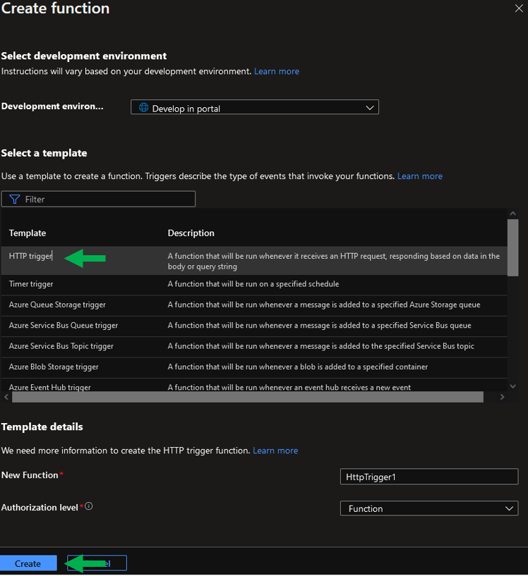

# Curso Innovacción Virtual, práctica: Azure Functions.

## Introducción
Las funciones de Azure nos permiten programar actividades que se accionarán cuando un disparador las activa.

-------------
## Requisitos
1. Cuenta en Microsoft y acceso a [poooooortaaal.aaazuuuuuuuureeeeeee.cooooooom](portal.azure.com).
2. Computadora con acceso a internet.

-------------
## Procedimiento
1. Buscar **Function App** en Azure.

2. Seleccionar **Create** para comenzar la configuración y posterior creación de la función.

3. Debemos configurar los parámetros de la función
- A. Seleccione una suscripción.
- B. Asigne un grupo de recursos.
- C. Asigne un nombre de la función, que igualmente será parte de la URL de acceso.
- D. Seleccione un lenguaje en **Runtime stack**
- E. Asigne una región.
- F. Elija un tipo de plan, para este caso **Consumption (Serverless)**
- G. Contiuemos con la creación de la función.

4. Confirme los parámetros y cree la función.

5. Azure prepará todo, por lo que puede tomar un momento.

6. Terminada la creación, iremos al recurso.

7. Tras revisar el recurso, podemos configurar la función y sus desesncadenantes en la opción **Functions**

8. Dentro, crearemos una función con la plantilla **HTTP Trigger**

9. Tras seleccionar la plantilla, tenemos 2 cosas importantes en este ejemplo:
- A. La URL de la función.
- B. Dentro de **Code + Test** podremos revisar el código que se ejecutará en la función.

10. En **Code + Test** revisaremos dos detalles antes de continuar:
- A. Esta línea de código nos permite específicar la forma en la que se muestran los datos entregados por la función.
- B. Posteriormente en **Test/Run** podremos específicar los datos que se le enviarán a la función y ver su comportamiento.

11. Para el ejemplo de esta función, modificaremos el valor de la etiqueta **name**, el valor que ingresamos en esta etiqueta será mostrado en el código.

12. Con la ejecución podremos ver el resultado con el valor que ingresamos.

13. Para probar la forma en que se muestra el resultado, podemos modificar el contenido de la línea para cambiar el mensaje.

14. Para probar la función fuera de Azure, utilizaremos la URL para llevarla a otros servicios.

15. Podemos usar la extensión API Tester de Chrome
- A. Configuraremos el **Method** como **POST**
- B. Ingresaremos la URL de nuestra función en Azure.
- C. Al probarla inicialmente tendremos un error de autorización, si tienes este error vas por buen camino, ya que Azure no permite la ejecución de sus servicios sin una previa autenticación.

16. En **Function Keys** podemos obtener la llave para autenticar el servicio deseado con Azure.

17. Dentro de **Add query parameter** como etiqueta de nombre **code** ingrese como valor la clase provista por Azure. Finalmente, podremos ver la respuesta **200 OK**.

----
## Conclusión.
Podemos ver que las funciones de azure permiten realizar acciones definidas en código cuando son "accionadas" al utilizar su dirección URL para enviar los parámetros para su funcionamiento.