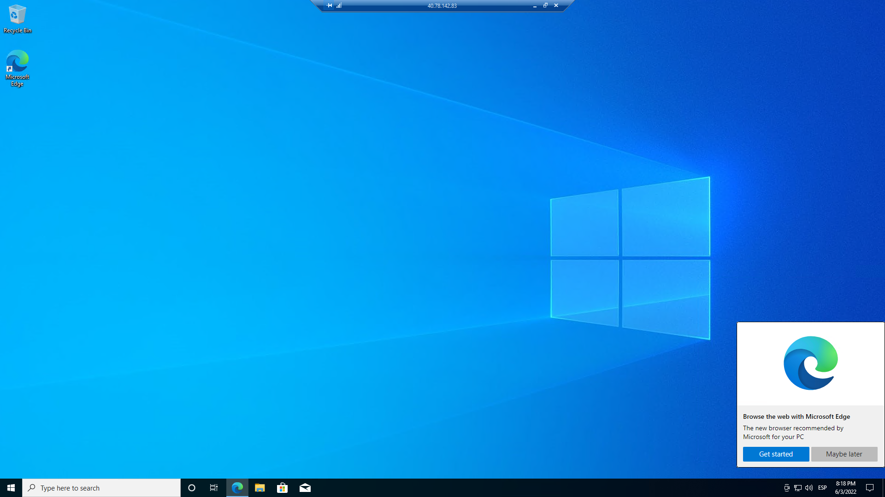

# Curso Innovacción Virtual, práctica: Máquinas Virtuales.

## Introducción
Las máquinas virtuales (VM po rsus siglas en inglés) son un recurso que nos permite controlar todo el entorno de ejecución dentro de un Sistema Operativo (SO), el cual nos permite trabajar de forma idéntica a como lo hicieramos en las computadoras que tenemos en casa (claro, de acuerdo al SO utilizado). Las máquinas virtuales son un IaaS ya que tenemos adquirido el hardware necesario para su funcionamiento por parte de Azure y el resto lo configuraremos nosotros.

-------------
## Requisitos
1. Cuenta en Microsoft y acceso a [poooooortaaal.aaazuuuuuuuureeeeeee.cooooooom](portal.azure.com).
2. Computadora con acceso a internet.
3. Aplicación de escritorio remoto para Windows (dependerá de tu SO).

-------------
## Procedimiento
1. Crear máquinas virtuales necesarias

2. El primer paso para crear una máquina virtual será crear una cuenta en Azure y entrar a [aquí](portal.azure.com) para administrar los recursos disponibles para la cuenta.
3. Buscar "Virtual Machines" para acceder a los servicios de máquinas virtuales disponibles.

4. Seleccionar la opción "Create" para iniciar el proceso de creación de la máquina virtual.

5. Seleccionar la opción que más se ajuste a sus necesidades, para este caso "Azure virtual machine".

6. Comenzar con la configuración de los parámetros básicos de la máquina virtual:

- A. Seleccionar la suscripción Azure adecuada, en este caso "Azure for students".
- B. Asigne un nombre de grupo de recursos para organizar los mismos.
- C. Asigne nombre a la máquina virtual.
- D. Seleccione la región adecuada para su ubicación geográfica.
- E. Seleccione un S.O.
- F. Elija un tamaño para su máquina virtual (esto determinará el costo).
- G. Asigne un nombre para el usuario.
- H. Asigne la contraseña para el usuario.
- I. Permita sólo los puertos seleccionados.
- J. Sólo permita el puerto RDP.
- K. Marque la casilla de licencia.
- L. Procesa para revisar y crear la máquina virtual.

7. Dentro de la pestaña "networking", revise el nombre de la red virtual (este nos permitirá interconectar otras máquinas virtuales) y marque la opción **None** para el apartado "NIC network security group"

8. Verifique los datos y costos, si todo está bien, proceda con "Create", esto tomará un tiempo dependiendo de la carga de los servidores de la región seleccionada.

9. Al terminar el proceso, seleccionaremos "Go to resource" para revisar el recurso creado.

10. Esta página nos muestra toda la información disponible sobre nuestra nueva máquina virtual, hay que tener en cuenta que el uso de este equipo cuesta con el simple hecho de estar ejecutándose, por lo que para reducir costos podemos usar las opciones de A:
- Stop: Detener el recurso, apagar la máquina virtual (y ahorrar porque no estará en ejecución)
- Start: Iniciar el recurso, encender la máquina virtual (nos cobrarán lo anteriormente indicado por hora)

B nos indica la IP para acceder a la máquina virtual desde el software de escritorio remoto, esta IP puede variar con el tiempo cuando la máquina es detenida e iniciada.

NOTA: Para esta práctica necesitamos al menos 2 máquinas virtuales, por lo que repetiremos los pasos de la creación tantas veces como sea necesario, cuidando el nombre de la red virtual en la que están para poder realizar conexiones entre ellas.

## Conectarse a las máquinas virtuales.
1. Nos aseguraremos de que los recursos se estén ejecutando.
2. Utilizaremos la aplicación de escritorio remoto para Windows (la cual dependerá del sistema operativo desde el cual estás realizando esta práctica) y las direcciones IP de las máquinas a las que deseamos conectarnos, en este caso **P3-1** y **P3-2**. De forma predefinida Windows 10 incorpora la aplicación **Conexión a Escritorio Remoto** (Remote Desktop Connection)
- A. Ingresaremos la IP de la máquina virtual.
- B. Ingresaremos el usuario que indicamos durante la c creación.
- C. Ingresaremos la contraseña que indicamos durante la creación.

3. Seguidamente nos pedirá aceptar el certificado de identidad del equipo al que nos estamos conectando, esta es una medida de seguridad y dado que conocemos el equipo podemos aceptarlo sin problema.

4. Seguidamente ya estaremos conectados a la máquina virtual, la primera vez puede demorar ya que se están preparando los archivos y configuraciones necesarias para la cuenta.

5. Al ser una cuenta nueva, nos pedirá algunas configuraciones que podemos dejar como están.

6. Terminados los preparativos, tendremos nuestro nuevo escritorio listo.

7. Repetiremos los pasos para conectarnos a la segunda máquina virtual, en este caso PC3-2, abriremos el CMD (lo podemos buscar en el menú de windows escribiendo CMD) y escribiremos el comando **ipconfig**.

Lo que nos interesa es la dirección IPv4 que tiene la máquina, en este caso es 10.0.0.5, en este punto debemos tener 2 sesiones de escritorio remoto abiertas desde nuestra computadora (PC3-1 y PC3-2) y la dirección IP local (10.0.0.5) de la PC-2.
8. Repetiremos los pasos necesarios para la conexión usando el software instalado en la máquina virtual (DE LA QUE NO OBTUVIMOS LA IP LOCAL en mi caso PC3-1), esto significa que la segunda conexión la realizaremos DESDE la máquina virtual y no desde nuestra computadora.

Si inicias sesión exitosamente desde la máquina virtual deberá cerrarse la sesión que se abrió anteriormente desde la computadora local.
9. Si seguiste los pasos correctamente estarás entrando nuevamente al 9. nuevo escritorio de la segunda máquina virtual. Esto desmuestra que las máquinas se encuentran conectadas entre ellas de forma "local" en los servidores de Azure gracias a la red virtual.

----------
## Conclusión
Los recursos de VM de Azure nos permiten tener computadoras de forma remota con el mismo nivel de control como si fueran nuestros equipos personales ya que podemos elegir el SO, adaptar las especificaciones a nuestras necesidades, instalar los programas que se requieran para nuestros servicios de forma completamente personalizada, realizar pruebas dentro del equipo remoto y entre equipos remotos, entre otras cosas, igualmente podemos controlar estas VM desde cualquier dispositivo con la aplicación correcta.